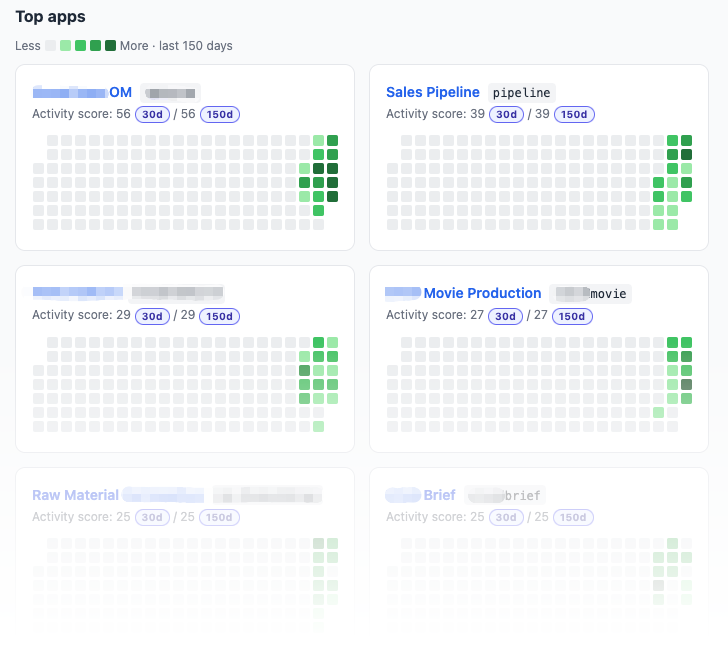

<div align="center">

# Ménagerai — Taming your wild, vibe-coded apps


**A self-hosted control plane for vibe-coded internal apps: one SSO portal,
per-app RBAC, an app catalog, audit logs, and usage analytics.**

[](https://github.com/menagerai/menagerai/actions/workflows/ci.yml)
[](./LICENSE)

</div>

Vibe coding lets teams ship AI-generated internal tools in hours. At enterprise
scale, that creates a new kind of **shadow IT**: apps running in production with
fragmented login, inconsistent access controls, and little visibility into who
uses what.

Menagerai adds post-deployment governance without forcing every app to rebuild
authentication. Put existing apps behind its ForwardAuth gateway, connect your
OIDC identity provider, and manage app-level access from one portal. Employees
sign in once; IT gets a centralized app inventory, default-deny authorization,
auditable access management, and adoption data for every app — on infrastructure
the organization controls.

---

## Why enterprise vibe coding needs governance

Lovable, Bolt, Replit, v0, and AI coding agents make it trivial to ship internal
apps. They do not answer the operational questions that follow:

- Who is allowed to open each app?
- How do people sign in **once** instead of per app?
- Is anyone actually *using* the thing we built?

Menagerai is the runtime access and visibility layer that answers all three. It is
**not** another identity provider: Menagerai owns the app catalog, per-app
authorization, auditability, and usage analytics, while delegating authentication
to the OIDC-certified identity provider you already trust.

## What Menagerai governs

These capabilities are usually spread across separate tools. Menagerai combines
them into one control plane for an organization's internal app portfolio.

| | Menagerai | Auth gateways<br>(Authelia, authentik…) | App dashboards<br>(Homarr, Homepage) | PaaS<br>(Coolify, Dokploy) |
|---|:---:|:---:|:---:|:---:|
| **Employee app portal and catalog** | ✅ | ⚠️ varies | ✅ | ❌ |
| **SSO enforcement on arbitrary deployed apps** | ✅ | ✅ | ❌ links only | ❌ |
| **App-level access policy managed in a UI** | ✅ | ⚠️ varies / often config | ❌ | ❌ |
| **Per-user / per-app adoption analytics** | ✅ | ❌ | ❌ | ❌ |

The **usage analytics** — a GitHub-style activity heatmap, power users, most-used apps — is the standout: it answers the manager's question ("is anyone using what we vibe-coded?") that pure-auth tools structurally cannot.

<p align="center">
  
</p>

## How the runtime governance layer works

```text
Your IdP proves identity.        (bring your own OIDC provider — Logto supported today)
Menagerai decides authorization. (default-deny RBAC, managed in a UI)
Your apps enforce access.        (a ForwardAuth gateway injects trusted identity headers)
```

- **Single sign-on** across every app behind the gateway, backed by your OIDC provider.
- **Default-deny authorization**: status → user-deny → user-allow → role-allow.
- **A ForwardAuth gateway** (Traefik today; more gateways over time) that authenticates and authorizes every request to a protected app and injects trusted identity headers.
- **An admin UI** for users, roles, apps, access rules, an audit log, and the usage
  dashboard.
- **A programmatic admin API** with personal API keys, generated OpenAPI docs, and
  full audit attribution — suitable for agents, CI jobs, and internal automation.
- **Works with the stack you already run** — bring your own OIDC provider and PaaS.

## Quickstart

**We strongly recommend [Coolify](https://github.com/coollabsio/coolify)** (open source) to self-host both the Menagerai platform and the vibe-coded apps you put behind it. This documentation is written with Coolify in mind; compatibility with other hosting platforms is untested and therefore not guaranteed.

Menagerai delegates authentication to **[Logto](https://github.com/logto-io/logto)** (cloud or self-hosted, open source), so you bring a Logto tenant and hand Menagerai six values. The app boots either way — if anything is missing or unreachable it serves a **configuration screen naming exactly what to fix**, so there is nothing to guess.

**1. In your Logto console, create two apps and one user:**

- A **Traditional Web** (OIDC) app for the portal → copy its **App ID** and **App secret**, and set its **Redirect URI** to `https://YOUR-PORTAL/callback`.
- A **Machine-to-Machine** app → copy its **App ID** and **App secret**, grant it the **Logto Management API access** role, and note the Management API **resource** URL (e.g. `https://your-tenant.logto.app/api`). This lets Menagerai create Logto accounts for users you add in the portal — no manual Logto steps afterward.
- Ensure your admin email exists as a **user** in Logto (or enable self-registration).

**2. Configure Menagerai:**

```bash
cp .env.example .env
```

Fill in the required values:

```ini
PORTAL_BASE_URL=https://YOUR-PORTAL          # or http://localhost:3000 for local
SUPERADMIN_EMAIL=you@yourcompany.com         # must also exist in Logto
LOGTO_ENDPOINT=https://your-tenant.logto.app
LOGTO_APP_ID=...
LOGTO_APP_SECRET=...
LOGTO_M2M_APP_ID=...
LOGTO_M2M_APP_SECRET=...
LOGTO_MANAGEMENT_API_RESOURCE=https://your-tenant.logto.app/api
```

(For a local `http://localhost` run, also set `COOKIE_SECURE=false`.)

**3. Run it:**

```bash
docker compose up -d --build
```

Open `PORTAL_BASE_URL` and sign in as `SUPERADMIN_EMAIL`. On the first valid startup Menagerai seeds your superadmin and a demo app, and your first sign-in claims the admin. Add further users right in the portal — with the Management API configured they are provisioned into Logto automatically.

> Seeing a **"Configuration required"** screen? It lists each setting that is unset or that Logto rejected (missing var, bad URL, wrong M2M role…). Fix your `.env`, then run `docker compose up -d` again — settings are read only at startup.

**Deploying for real?** See the [**Deployment & Bootstrap Runbook**](./DEPLOY.md) for the full production setup on Coolify — not just deploying Menagerai itself, but also **how to bring your own apps under its gateway** (per-app access control, trusted identity headers, and end-to-end verification).

## Programmatic administration for agents and automation

Everything an administrator can manage in the portal — users, roles, app registrations,
role grants, per-user overrides, email allow rules, proxy secrets, and audit logs — is
also available as a JSON API under `/api/admin`. This makes Menagerai usable from AI
agents, CI jobs, provisioning workflows, and other internal integrations without browser
automation.

1. Sign in as an administrator and open **Admin → API access**.
2. Create a named personal key and copy it immediately; the secret is shown only once.
3. Send the key with the HTTP Bearer authentication scheme (recommended) or the
   `X-API-Key` request header.

```bash
export MENAGERAI_URL="https://portal.example.com"
export MENAGERAI_ADMIN_API_KEY="dvk_..."

curl -sS "$MENAGERAI_URL/api/admin/users?q=jane" \
  -H "$(printf 'X-API-Key: %s' "$MENAGERAI_ADMIN_API_KEY")" \
  -H "Accept: application/json"
```

Keys carry the full admin authority of their owner, can be revoked independently, and
are stored only as hashes. API-triggered changes are marked as API activity in the audit
log and attributed to the key that performed them.

For discovery and client generation, signed-in admins can use the interactive Swagger UI
at `/admin/docs` or download the generated OpenAPI 3.1 document from
`/admin/openapi.json`. Both are generated from the same route registry as the live API.

Agent authors can start with the repository's white-label
[**Menagerie Management skill**](./skills/menagerie-management/SKILL.md), which includes
safe operating rules, the endpoint reference, common workflows, and a dependency-free
Python helper.

## Design, architecture, and app onboarding

The system is documented in depth. These design docs are being published alongside the code and double as the "how to onboard a vibe-coded app in 10 minutes" guide.

## What this is *not*

Scope discipline keeps an access-control plane trustworthy:

- **Not an identity provider.** We never store credentials — authentication is delegated to a certified OIDC IdP. That is a security feature, not a gap.
- **Not multi-tenant.** One deployment = one organization. For self-hosted white-label that is the honest, simple architecture.
- **Not a PaaS.** Menagerai governs the apps you deploy; it does not deploy them.
- **Not an application security scanner.** Menagerai secures access to an app; it
  does not review generated source code, manage the app's secrets, or replace
  secure software review and production-readiness checks.

## Roadmap

- **Now** — one-command `docker compose up` quickstart, env-validated startup with a self-explaining config screen, and a seeded demo app (all in this repo).
- **Next** — broader provider support (more gateways, identity providers, and database options over time) behind the existing pluggable abstractions. Storage runs on a bundled **SQLite** file by default, with **MongoDB** as a pluggable alternative today.

## Frequently asked questions (FAQ)

### What is enterprise vibe coding governance?

It is the set of controls that lets teams use AI-assisted development without
losing organizational visibility. Menagerai focuses on post-deployment runtime
governance: which internal apps exist, who may access each one, and whether those
apps are actually being used.

### How do I add SSO to a vibe-coded app?

Put the app behind Menagerai's ForwardAuth gateway. Menagerai handles the OIDC
login and app-level access decision before forwarding an allowed request with
trusted identity headers. Simple apps do not need to implement their own login.

### Can Menagerai protect an existing app without changing its code?

Yes, for apps that can run behind a reverse proxy. The gateway can enforce SSO
and per-app access before the request reaches the app. Apps that need finer-grained
permissions can also use native OIDC or shared middleware.

### How does IT control access to AI-generated internal apps?

Admins manage users, organizational roles, app grants, and direct user overrides
in the Menagerai UI. Access is default-deny, and a user-level deny acts as an
app-specific kill switch even when a broader role grants access.

### How can I see whether internal apps are being used?

Menagerai records daily active usage at the gateway and provides per-app and
per-user adoption analytics, including an activity heatmap, most-used apps, and
power users.

### Is Menagerai an identity provider or deployment platform?

Neither. Bring your existing OIDC identity provider and deploy apps using your
existing PaaS or infrastructure. Menagerai sits between them as the app catalog,
authorization, and usage-visibility layer.

## Contributing

Contributions are welcome — see [CONTRIBUTING.md](./CONTRIBUTING.md) and our [Code of Conduct](./CODE_OF_CONDUCT.md). To report a vulnerability, follow [SECURITY.md](./SECURITY.md) (please do not open a public issue).

## License

Menagerai is licensed under the **GNU Affero General Public License v3.0** — see [LICENSE](./LICENSE). The AGPL keeps the project and its network-hosted derivatives open. For commercial licensing enquiries, open a discussion.
